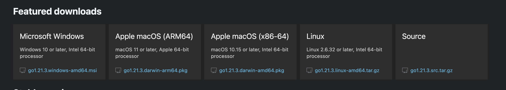
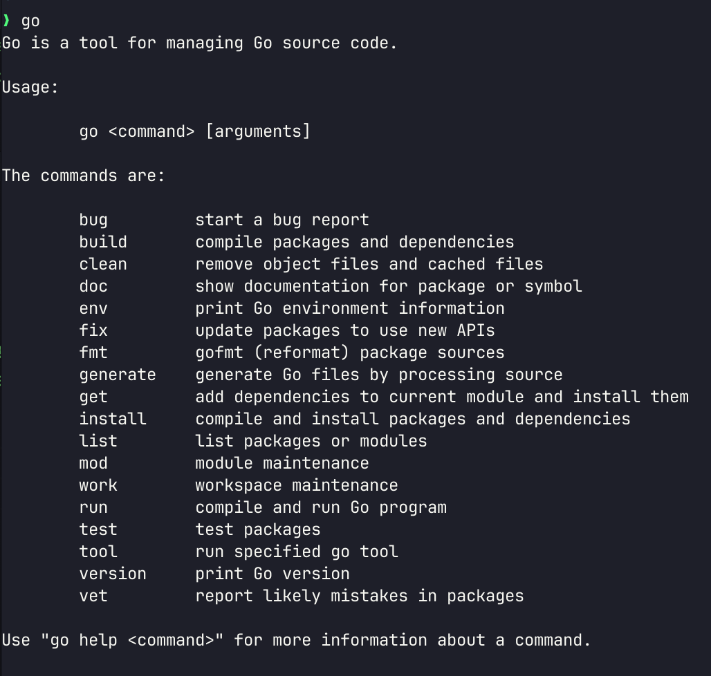

# Installation

10.10.0 apps only need [go](https://go.dev/) to run. The rest of tools in this installation guide are to make an awesome developer experience.

## Install Golang

[Download go](https://go.dev/dl/) for your OS and install it.



The official instructions are [here](https://go.dev/doc/install).

You should aim to have the `go` command working in your terminal.

If you are using Windows, the installer should setup the path for you.

Ensure that `go` is on your path, you should be able to type go in `terminal` or `cmd/powershell` and see the help output.



Once go is installed, you can add the GOPATH to your system path. GOPATH is where go will install any tools installed using `go install`, This is typically your `$HOME/go/bin`, this should be added to your system PATH to allow you to run installed tools.

## Node

10.10.0 apps do not run in node but we use node to generate css with tailwind.

Download and install [node](https://nodejs.org/en/download)

## Tailwind and Prettier

We use [Tailwind](https://tailwindcss.com/) for styling, and [Prettier](https://prettier.io/) for formatting.

```bash
npm install -g prettier tailwindcss
```

## Air

For building and auto rebuild we user [air](https://github.com/cosmtrek/air)

```bash
go install github.com/cosmtrek/air@latest
```

## Templ

We use [templ](https://templ.guide/) to generate the HTML pages from Go.

```bash
go install github.com/a-h/templ/cmd/templ@latest
```

## Make

You must be on MacOS/Linux in order to use Make. Windows users can install [WSL](https://learn.microsoft.com/en-us/windows/wsl/install) to use Make.

To simply run the app, run the following command from the root of the project:

```bash
make
```

## (Optional) Install the vision cli for bootstrapping projects

Install the [vision-cli](https://github.com/vision-cli) tool which is used create 10.10.0 project scaffolding.

```bash
go install github.com/vision-cli/vision@latest
```

Install the vision 10100 plugin

```bash
vision install 10100
```

You should see the plugin listed when you run the command

```bash
vision plugins list
```
