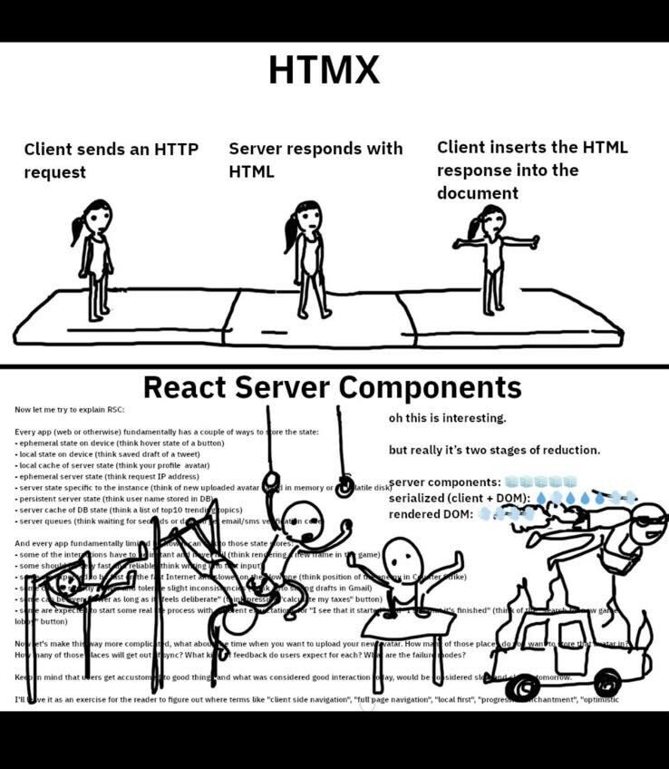

# Frontend

Frontends are written in golang and served by the golang http server. You will also need [node](https://nodejs.org/en) for tailwind. HTMX is used to make the app interactive. This means that Go will render the initial page, and then use HTMX to make the app interactive.

- [templ](https://templ.guide) for rendering the html fragments
- [htmx](https://htmx.org) for AJAX, CSS Transitions, WebSockets and Server Sent Events directly in HTML
- For building and auto rebuild we user [air](https://github.com/cosmtrek/air)
- [Tailwind](https://tailwindcss.com/) for styling, and [Prettier](https://prettier.io/) for formatting.
- [Make](https://www.gnu.org/software/make/) for build automation

## Why not ReactJS or Angular or something similar?

