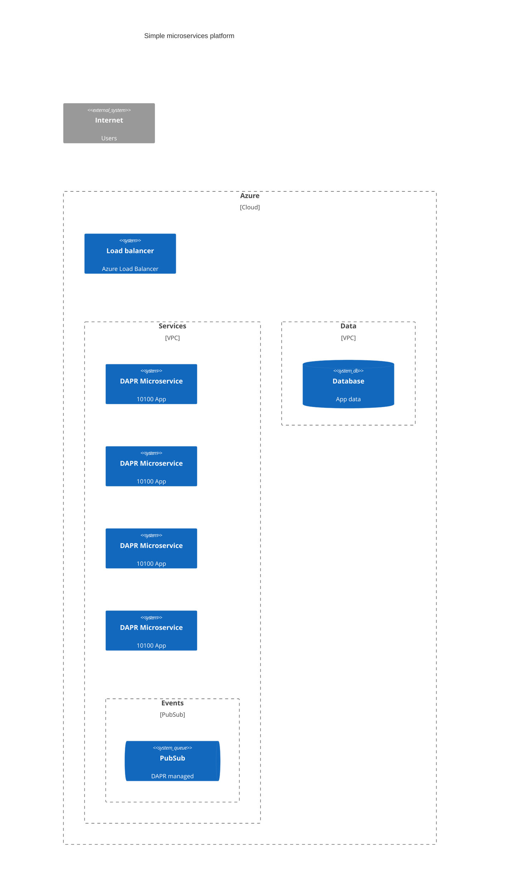

# Microservices platform

- terraform or bicep
- make

##  Azure

Microsoft Azure have some very useful features that can be used to create a microservices platform with zero ops.
[Dapr architecture](https://learn.microsoft.com/en-us/azure/architecture/example-scenario/serverless/microservices-with-container-apps-dapr) is a good example of this.
We can simplify this further by using only ACI and Dapr where needed.

