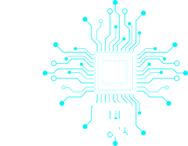

    <h1>What is 10.10.0?</h1>
    

10.10.0 is an approach to building enterprise apps based on the GoTTH stack ( [Golang](https://go.dev), [Tailwind](https://tailwindcss.com), [Templ](https://templ.guide) and [HTMX](https://htmx.org)). This enables the [rapid](what/develop.md) development of [evergreen](what/evergreen.md) and [zero ops](what/zero.md) apps, with the intention of reducing the cost of building and running good software, and focussing spend on new features over maintenance.

[Golang](https://go.dev) is used for frontend and backend development because of its backward compatibility guarantee, meaning code that is written today will be guaranteed to compile in the future with no changes (as has been the case for that last 13 years).

10.10.0 apps have almost no direct dependencies which means these apps have minimal supply chain issues such as obsolescence, patching, or supply chain vulnerabilities. The few dependences that are used have been stable for many years and have no transitive dependencies.

10.10.0 apps use technologies pioneered in **digital natives**, but are tailored to meet the requirements and complexities found in **enterprise**. Specifically:

- Favour architectural simplicity for long term maintainability, over complex high throughput requirements of digital natives
- Include enterprise required operational and security controls
